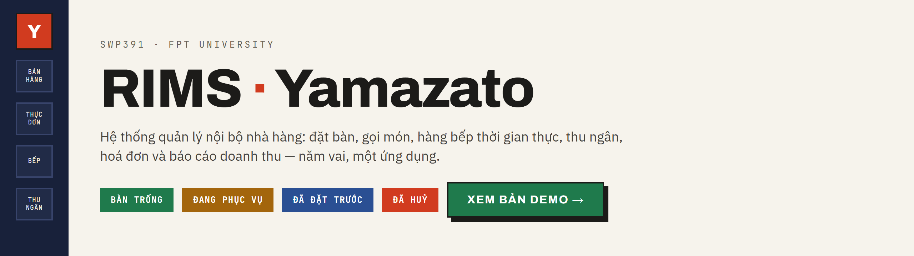
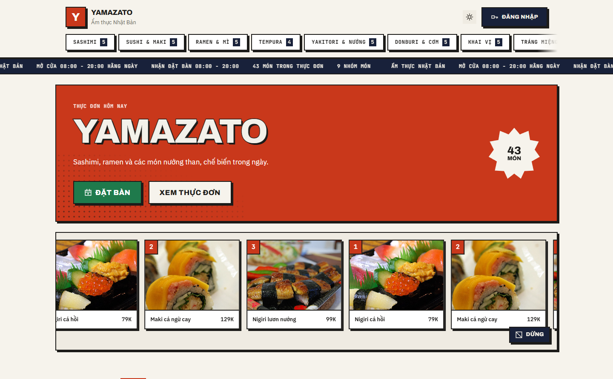
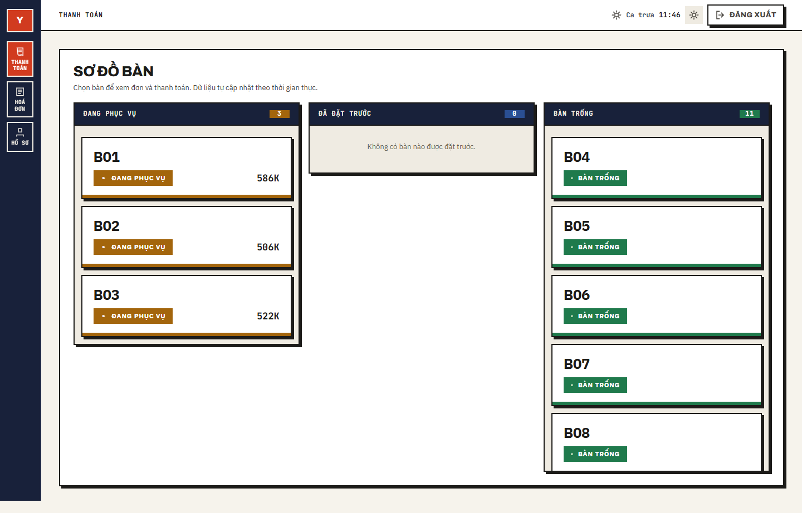
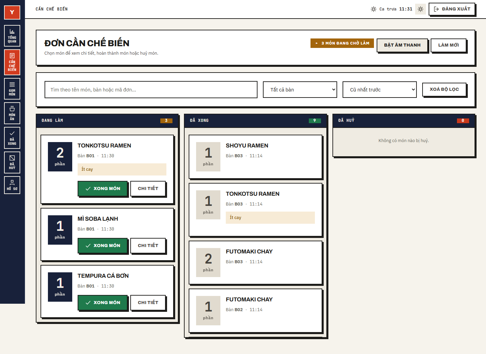
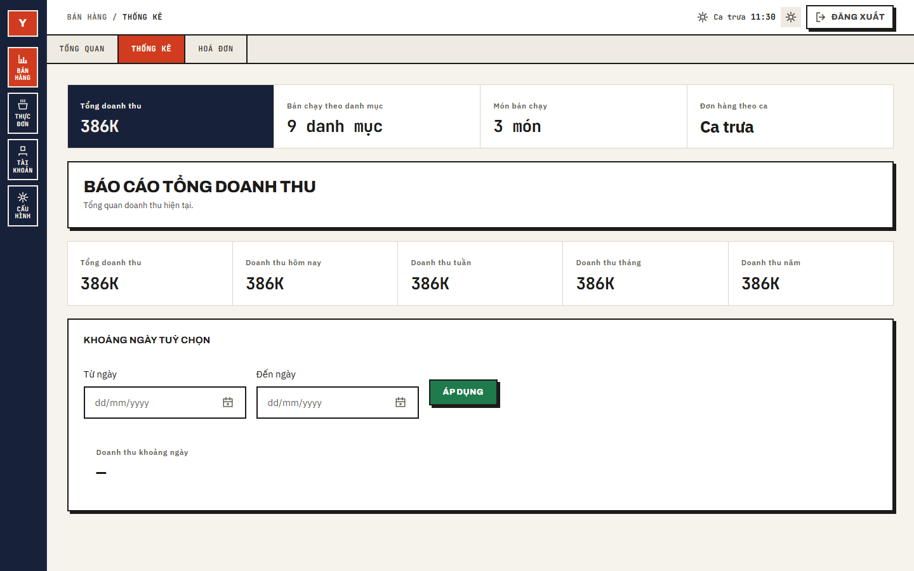

# RIMS — Restaurant Internal Management System

Hệ thống quản lý nội bộ nhà hàng: đặt bàn, gọi món, hàng bếp thời gian thực,
thu ngân, hoá đơn và báo cáo doanh thu. Năm vai dùng chung một ứng dụng.

Đồ án môn **SWP391 — FPT University**.

---

## Bản demo

### ▶ **[yamazato.onrender.com](https://yamazato.onrender.com)**

Đăng nhập bằng một trong các tài khoản dưới đây. Mật khẩu hỏi người trong nhóm.

| Vai | Tài khoản | Xem được gì |
| --- | --- | --- |
| Quản trị viên | `admin` | Doanh thu, thực đơn, tài khoản, sơ đồ mặt bằng, hoá đơn |
| Phục vụ | `waiter01` | Sơ đồ bàn, mở đơn, gọi món, đặt bàn |
| Bếp | `chef01` | Hàng món cần làm, gom món, báo xong hoặc xin huỷ |
| Thu ngân | `cashier01` | Bàn đang phục vụ, thu tiền mặt hoặc mã QR, in hoá đơn |
| Khách hàng | `kh001` | Đặt bàn, xem lượt đặt, điểm tích luỹ |

> Dịch vụ chạy trên gói miễn phí nên **ngủ sau một lúc không ai vào**. Lần mở
> đầu tiên có thể phải chờ tới **3 phút** để máy chủ dậy — không phải app hỏng.

---

## Vài màn hình

| Trang chủ khách xem | Thu ngân — sơ đồ bàn |
| --- | --- |
|  |  |

| Bếp — hàng món cần làm | Quản trị — thống kê |
| --- | --- |
|  |  |

---

## Làm được gì

**Đặt bàn** — khách tự đặt hoặc phục vụ đặt hộ. Hệ thống tự giữ bàn khi sắp tới
giờ và tự huỷ lượt đặt quá hạn, không cần ai canh.

**Gọi món** — phục vụ mở đơn theo bàn, thêm và sửa món. Món bay thẳng sang màn
bếp qua WebSocket, không phải bấm làm mới.

**Bếp** — xem theo từng món hoặc gom các món giống nhau của nhiều bàn. Báo xong,
xin huỷ, ghi chú nội bộ, bật hoặc tắt món khi hết nguyên liệu.

**Thu ngân** — khoá đơn, tra khách theo số điện thoại để tích và tiêu điểm, thu
tiền mặt hoặc quét mã VNPay, xuất hoá đơn PDF.

**Quản trị** — thực đơn, danh mục, tài khoản, bàn, sơ đồ mặt bằng kéo thả, và
báo cáo doanh thu theo ngày / tuần / tháng / ca, món bán chạy, lịch sử hoá đơn.

**Chung** — phân quyền theo vai bằng JWT, bắt đổi mật khẩu lần đầu, quên mật
khẩu qua OTP email, giao diện sáng / tối.

---

## Công nghệ

| Phần | Dùng gì |
| --- | --- |
| Backend | Java 21 · Spring Boot 4 · Spring Data JPA · Spring Security (JWT) · WebSocket STOMP |
| Cơ sở dữ liệu | PostgreSQL 16+ |
| Frontend | React 19 · TypeScript · Vite 8 · React Router 7 · Axios · SockJS + StompJS |
| Bên ngoài | VNPay (thanh toán) · Brevo (gửi email OTP qua HTTP API) |
| Kiểm thử | JUnit 5 + Mockito + AssertJ · Vitest · Playwright |

Giao diện **không dùng framework CSS, không dùng thư viện icon**. Bộ component
và bộ icon đều viết riêng, dựng trên các biến trong
`frontend/src/styles/tokens.css`. Hệ thiết kế đầy đủ ở [`design.md`](design.md),
bản xem được ở [`design.html`](design.html) — nó nạp thẳng CSS thật của app nên
không thể nói khác app.

---

## Chạy ở máy

Cần: **JDK 21**, **Node 20.19+**, **PostgreSQL 16+**. Maven đi kèm sẵn (`mvnw`).

```bash
# 1. Lấy mã nguồn và tạo file cấu hình
git clone <url-repo> && cd RIMS
cp .env.example .env

# 2. Tạo database rỗng (bảng và dữ liệu mẫu sẽ tự sinh ở lần chạy đầu)
createdb rims_db

# 3. Backend — http://localhost:8080
cd backend/rims-api && ./mvnw spring-boot:run

# 4. Frontend — http://localhost:5173
cd frontend && npm install && npm run dev
```

Mở `.env` điền các giá trị thật trước khi chạy bước 3. Thiếu là backend **không
khởi động** và nói rõ thiếu cái gì:

| Biến | Là gì | Lấy ở đâu |
| --- | --- | --- |
| `DB_PASSWORD` | Mật khẩu PostgreSQL | Bạn đặt lúc cài |
| `JWT_SIGNER_KEY` | Khoá ký JWT, tối thiểu 32 ký tự | `openssl rand -base64 48` |
| `BREVO_API_KEY` | Khoá gửi email OTP | [brevo.com](https://www.brevo.com) → SMTP & API → API Keys |
| `MAIL_FROM_EMAIL` | Địa chỉ đứng tên gửi | Brevo → Senders (Gmail dùng được, không cần tên miền riêng) |
| `VNPAY_HASH_SECRET` | Khoá ký giao dịch | Tài khoản sandbox VNPay |
| `RIMS_ADMIN_PASSWORD`<br>`RIMS_ADMIN_EMAIL` | Tài khoản quản trị đầu tiên | Bạn tự chọn |

Repo **không chứa tài khoản nào**. Lần chạy đầu, khi bảng `users` còn rỗng, app
tạo một tài khoản `admin` từ hai biến cuối bảng và bắt đổi mật khẩu ngay lần
đăng nhập đầu tiên. Email là bắt buộc vì đó là đường lấy lại mật khẩu duy nhất.

**Chỉ muốn xem giao diện, chưa dựng CSDL?**

```bash
cd frontend && npm run dev:mock
```

Chạy app **không cần backend**, dữ liệu giả cố định. Đăng nhập mật khẩu bất kỳ,
tên đăng nhập quyết định vai. Chỉ đọc — bấm Lưu sẽ không lưu gì.

<details>
<summary><b>Các lệnh khác ở <code>frontend/</code></b></summary>

| Lệnh | Việc |
| --- | --- |
| `npm run build` | Kiểm kiểu, chạy test, rồi build production |
| `npm run typecheck` | Chỉ kiểm kiểu TypeScript |
| `npm run lint` · `npm run lint:fix` | ESLint |
| `npm run format` · `npm run format:check` | Prettier |
| `npm test` · `npm run test:watch` | Vitest |
| `npm run e2e` · `npm run e2e:ui` | Playwright |

> Kiểm kiểu phải gọi `npm run typecheck`, **không** gọi `npx tsc --noEmit`:
> `tsconfig.json` ở gốc là dạng references với `"files": []`, nên `--noEmit`
> chạy qua mà không kiểm file nào cả.

</details>

---

## Đưa lên máy chủ

Toàn bộ quy trình — Neon, Render, Docker, biến môi trường, cron giữ cho app
không ngủ, và những lỗi chỉ lộ ra khi deploy — nằm ở **[DEPLOY.md](DEPLOY.md)**.

Bản rút gọn: `Dockerfile` ở gốc repo dựng **một ảnh chứa cả hai nửa** — build
React, chép vào thư mục tĩnh của Spring Boot, đóng thành jar. Một dịch vụ, một
tên miền, nên không có CORS và WebSocket nối thẳng.

```bash
docker build -t rims .
```

---

## Tài liệu

| File | Nội dung |
| --- | --- |
| [`DEPLOY.md`](DEPLOY.md) | Hướng dẫn deploy từ đầu đến cuối |
| [`design.md`](design.md) · [`design.html`](design.html) | Hệ thiết kế giao diện |
| `docs/SWP SU26 SRS.docx` | Đặc tả yêu cầu phần mềm |
| `docs/Functions List.xlsx` | Danh sách chức năng, đối chiếu với 102 endpoint |
| `docs/System Test.xlsx` | Ca kiểm thử hệ thống |
| `docs/common_diagram.drawio` | Sơ đồ ngữ cảnh, kiến trúc, ERD, luồng nghiệp vụ |
| `docs/UC_SCR.drawio` | Sơ đồ use case và luồng màn hình theo từng vai |

---

## Nhóm 6

| MSSV | Tên |
| --- | --- |
| HE190385 | Nguyễn Thành Vinh |
| HE194015 | Phạm Tuấn Anh |
| HE172532 | Nguyễn Thị Thu Hiền |
| HE191779 | Nguyễn Xuân Bắc |
| HE191410 | Phạm Minh Nghĩa |
| HE200426 | Nguyễn Anh Tuấn |
